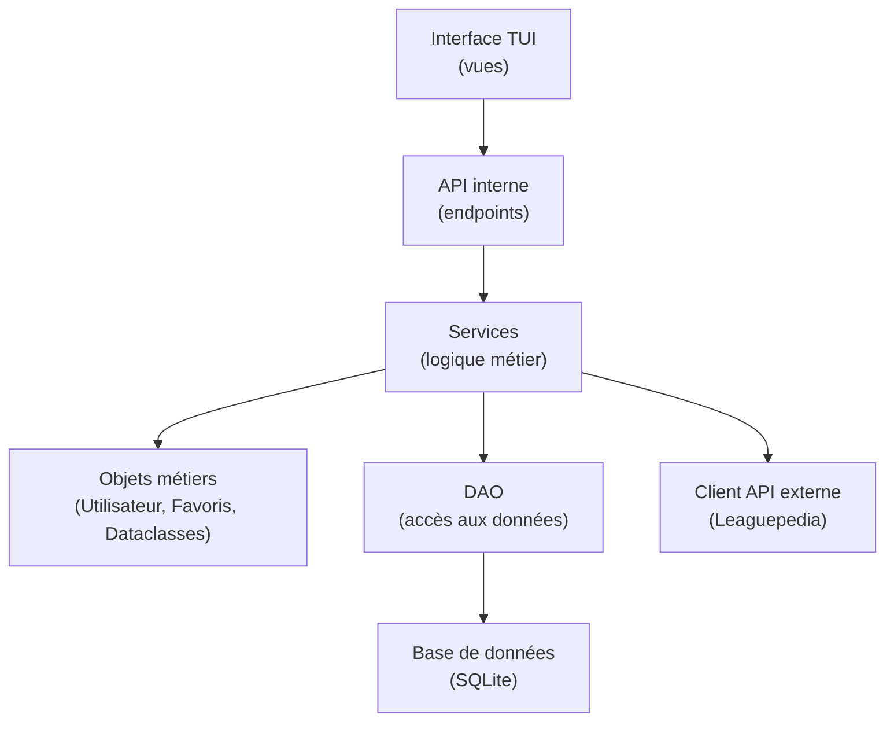

# Architecture



# pythonpath

Pour que Python saches que backend contient les modules,Faire d'abord dans le terminal à la racine du projet:

```bash
export PYTHONPATH=$(pwd)/backend
```

# localhost

http://127.0.0.1:8000/

# projet-conception-logicielle

Application de classement et statistique d’e-sports ou de sports (en fonction des bbd et api disponible)

Permet à l'utilisateur de:

1 - Créer un compte sécurisé. 

2 - Regarder les statistiques et classement de joueurs, équipes dans une compétition.

3 - Sélectionner des favoris pour trouver plus rapidement des informations (joueurs/équipes/compétitions)

4 - Être prévenu des prochains matchs et/ou des nouveaux résultats

Fonctionnalités principales : 

Gestion de comptes utilisateurs:
- Création 
- Authentification (id + mdp)
- Infos de base
- Accès sécurisé à l'appli

Notification et Communication:
- Rappel des matchs de la semaine
- Nouveaux résultats (favori ou non)

Gestion des favoris (joueurs/compétition)
- Créer des favoris (liste)
- Visibilité des favoris
- Supprimer des favoris

Gestion des classements et stats
- Visualisation des stats
- Filtrer les équipes/compétitions/joueurs 
- Rechercher par joueur (gestion de l'orthographe)

## :arrow_forward: Logiciels et outils

- [Visual Studio Code](https://code.visualstudio.com/)
- [Python 3.13](https://www.python.org/)
- [Git](https://git-scm.com/)
- [PostgreSQL](https://www.postgresql.org/)
- [FastAPI](https://fastapi.tiangolo.com/)
- [InquirerPy](https://inquirerpy.readthedocs.io/en/latest/)
- [pytest](https://docs.pytest.org/)

## :arrow_forward: Cloner le dépôt

- [ ] Ouvrir VSCode
- [ ] Ouvrir **Git Bash**
- [ ] Cloner le dépôt
  - `git clone https://github.com/SimonHerve22/projet-conception-logicielle.git`

### Ouvrir le dossier du projet

- [ ] Lancer **Visual Studio Code**
- [ ] Aller dans `Fichier > Ouvrir un dossier`
- [ ] Sélectionner le dossier `projet-conception-logicielle`
  - Ce dossier devrait être la **racine** de l'Explorateur VSCode.
  - :warning: Si ce n'est pas le cas, l'application risque de ne pas démarrer. Dans ce cas, essayez de rouvrir le dossier.

## Aperçu des fichiers du dépôt

| Fichier / Élément          | Description                                                                 |
| -------------------------- | --------------------------------------------------------------------------- |
| `README.md`                | Contient toutes les informations nécessaires pour comprendre, installer et utiliser le projet |
|                            |                                                                             |


### Fichiers de configuration

Ce projet inclut plusieurs fichiers de configuration utilisés pour configurer les outils, workflows et paramètres du projet.

Dans la plupart des cas, **vous n'avez pas besoin de modifier ces fichiers**, sauf :

- `.env` → pour configurer les variables d'environnement comme la connexion à la base de données et l'hôte du webservice

| Fichier                   | Description                                                                 |
| ---------------------------- | --------------------------------------------------------------------------- |
| `uv.lock   `                 | Creation d'un environement virtuel avec des import cohérents                |
|`.ruff.html`                  | Gestion des parramètre des erreur et du formatage                           |
| `pyproject.toml`             | Liste des version des import                                                |
| `.gitignore`                 | Liste les fichiers et dossiers à exclure du contrôle de version             |
| `logging_config.yml`         | Configuration pour la journalisation, incluant les niveaux de log et le formatage |
| `.env`                       | Variables d'environnement pour la base de données, le webservice et autres paramètres |

> :information_source: Assurez-vous de créer et configurer le fichier `.env` comme décrit ci-dessous avant d'exécuter le projet.

### Dossiers du projet

| Dossier | Description                                                                 |
| ------------- | --------------------------------------------------------------------------- |
| `backend/`    | Code source Python organisé en architecture en couches (DAO, Service, BO, View)                |
| `database/`   | Scripts SQL pour initialiser et peupler la base de données                  |
| `frontend/`   | Frontend de l'application (vide)                                            |
| `kubernetes/` | Script pour le deploiement kubernetes (vide)                                |
| `logs/`       | Gestion des logs de l'application                                           |


## :arrow_forward: Installer les packages requis

Pour que le projet fonctionne correctement, vous devez installer toutes les dépendances Python nécessaires.

### Étapes

1. Ouvrez votre terminal (Git Bash, PowerShell, ou autre).
2. Installez le'environement virtuel via uv :

```bash
uv sync
```

## :arrow_forward: Variables d'environnement

Pour que votre application Python fonctionne correctement, vous devez définir certaines **variables d’environnement** afin de configurer la connexion à la base de données et au webservice.

### Étapes

1. À la racine du projet, créez un fichier nommé `.env`.
2. Copiez-y les variables suivantes et complétez-les avec vos informations :

```env
# Adresse du webservice
HOST_WEBSERVICE=https://user-id2833-736673-user.user.lab.sspcloud.fr

# Configuration de l'API : Nous ne savions pas quelle adresse mettre 
HOST_WEBSERVICE=https://xxx.fr
```
## :arrow_forward: Tests unitaires

Pour vérifier que toutes les fonctionnalités du projet fonctionnent correctement, vous pouvez exécuter les tests unitaires fournis.

### Étapes

1. Ouvrez votre terminal (Git Bash, PowerShell, ou autre).
2. Lancez les tests avec `pytest` :

Pour que Python saches que src contient les modules,Faire d'abord dans le terminal à la racine du projet:

```bash
export PYTHONPATH=$(pwd)/backend
```

```bash
# Commande standard
pytest -v

# Si pytest n'est pas dans votre PATH
python -m pytest -v

```

## :arrow_forward: Lancer l’application CLI

L’application en ligne de commande (CLI) offre une interface **interactive simple** pour naviguer dans les différents menus du serveur de poker.

### Étapes

1. Lancer d'abord sur un premier terminal

```bash
python backend/app.py
```
- Le script initialise la base de données en exécutant les fichiers SQL présents dans le dossier `data/`

2. Ensuite ouvrez un autre terminal et lancez l’application avec la commande suivante :

```bash
python backend/main.py
```
Cela démarrera l’application CLI, vous permettant d’interagir avec le serveur.


