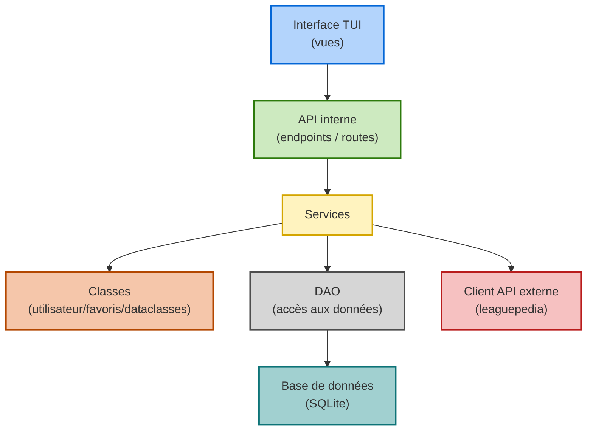

# Projet-conception-logicielle

Application de classement et statistique d’e-sports ou de sports (en fonction des bbd et api disponible)

Fonctionnalités : 

Gestion de comptes utilisateurs:
- Création 
- Authentification (id + mdp)

Gestion des favoris (joueurs/compétition)
- Créer des favoris (liste)
- Visibilité des favoris

Gestion des classements et stats
- Visualisation des stats
- Filtrer les équipes/compétitions/joueurs 

## :arrow_forward: Cloner le dépôt

- [ ] Ouvrir **Visual Studio Code**
- [ ] Ouvrir **Git Bash**
- [ ] Cloner le dépôt
  - `git clone https://github.com/SimonHerve22/projet-conception-logicielle.git`

## :arrow_forward: Ouvrir le dossier du projet

- [ ] Lancer **Visual Studio Code**
- [ ] Aller dans `Fichier > Ouvrir un dossier`
- [ ] Sélectionner le dossier `projet-conception-logicielle`

### Dossiers du projet

| Dossier | Description |
| ------------- | --------------------------------------------------------------------------- |
| `backend/`    | Code source Python du serveur organisé en architecture en couches (DAO, Service, BO)  |
| `frontend/`   | Frontend de l'application |
| `kubernetes/` | Pour le deploiement kubernetes    |

## :arrow_forward: Variables d'environnement

Pour que l'application Python fonctionne correctement, vous devez définir certaines **variables d’environnement** afin de configurer la connexion au webservice.

1. À la racine du projet, créez un fichier nommé `.env`.
2. Copiez-y la variable suivante et indiquez l'adresse ou vous comptez lancer l'application backend:

```env
# Adresse du webservice
HOST_WEBSERVICE=http://127.0.0.1:8000/
```

## :arrow_forward: Lancer le serveur

L'application backend lolec expose différents endpoints permettant de gérer un compte, des favoris et de la recherche d'informations sur 
la ligue LEC.

### Étapes

1. Lancer un terminal et placez-vous dans le dossier backend

2. Installez l'environment virtuel du frontend via uv :

```bash
uv sync
```

3. Lancez l'application avec la commande suivante :

```bash
python app.py
```
Cela lancera le serveur.

## :arrow_forward: Lancer le frontend TUI

L’application en ligne de commande (TUI) offre une interface **interactive simple** pour naviguer dans différents menus.

### Étapes

1. Lancer d'abord sur un premier terminal le serveur backend en suivant le point précédent du Readme

2. Ouvrez un nouveau terminal et placez-vous dans le dossier frontend

3. Installez l'environment virtuel du frontend via uv :

```bash
uv sync
```

4. Lancez les vues avec la commande suivante :

```bash
python main.py
```
Cela démarrera le frontend TUI, vous permettant d’interagir avec le serveur.

## Comment lancer les conteneurs en local front et back

Serveur :

sudo docker run -p 8000:8000 conteneur_backend

Front (TUI) :

sudo docker run -it -e HOST_WEBSERVICE=http://127.0.0.1:8000/ --network=host conteneur_frontend

ou

sudo docker run --add-host=host.docker.internal:host-gateway -it -e HOST_WEBSERVICE=http://host.docker.internal:8000/ conteneur_frontend


## Architecture


